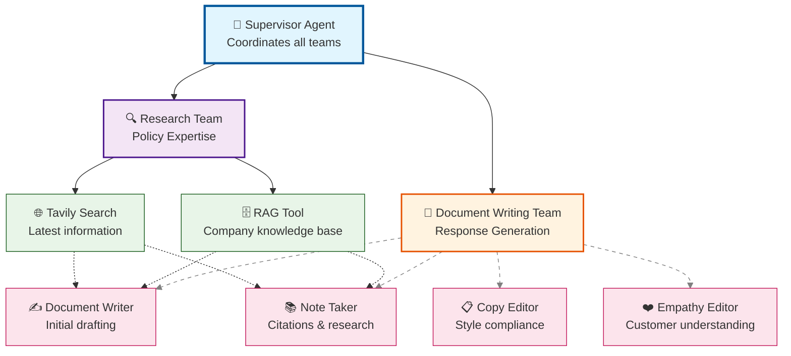

# 🏛️ Legal Aid Navigator

An AI-powered RAG system that helps tenants understand their legal rights and navigate complex housing laws across different jurisdictions.

## 📋 Problem Statement

Tenants facing housing issues struggle to understand their legal rights and navigate complex housing laws that vary by location. Legal aid services are often overwhelmed, and online resources are generic and not location-specific.

### Target Audience
- **Renters** facing eviction, repair issues, or rental disputes
- **Legal aid volunteers** assisting tenants with housing cases
- **Tenant union organizers** educating members about their rights

## 🚀 Proposed Solution

We're building an advanced RAG (Retrieval-Augmented Generation) system that can answer questions about tenant rights and provide actionable guidance. The system will leverage multi-agent reasoning for complex queries and advanced retrieval techniques for accurate information fetching.

## 🛠️ Tech Stack

| Component | Choice | Justification |
|-----------|---------|---------------|
| **LLM** | GPT-4o | Best reasoning for legal nuance, cost-effective |
| **Embeddings** | text-embedding-3-small | High quality, fast, cheap |
| **Vector DB** | Chroma | Simple, good enough for prototype |
| **Orchestration** | LangChain | Rapid prototyping, good agent support |
| **UI** | Streamlit | Fastest path to demo-able interface |
| **Evaluation** | RAGAS | Industry standard for RAG evaluation |
| **Monitoring** | LangSmith | Free tier, excellent tracing |

## 🗂️ Project Structure

```mermaid
graph TD
    A[legal-aid-navigator/] --> B[data/]
    A --> C[src/]
    A --> D[tests/]
    A --> E[frontend/]
    A --> F[config/]
    A --> G[docs/]
    
    B --> B1[raw/]
    B --> B2[processed/]
    B --> B3[golden_set/]
    
    C --> C1[data_ingestion.py]
    C --> C2[chunking_strategy.py]
    C --> C3[embedding_pipeline.py]
    C --> C4[rag_core.py]
    C --> C5[multi_agent_system.py]
    C --> C6[evaluation.py]
    C --> C7[advanced_retrieval.py]
    
    D --> D1[test_retrieval.py]
    D --> D2[golden_dataset/]
    
    E --> E1[app.py]
    E --> E2[components/]
    
    F --> F1[settings.yaml]
    
    G --> G1[project_plan.md]
    
    A --> H[requirements.txt]
    A --> I[README.md]
    A --> J[.env.example]
```

## 📊 Implementation Roadmap
## 🎯 Task 1: Problem and Audience

### 🧩 Problem
Tenants facing housing issues struggle to understand their legal rights and navigate complex housing laws.  
The legal landscape varies significantly by jurisdiction, making it difficult for renters to find accurate, location-specific information.

### 👥 Audience
- Renters facing eviction, repair issues, rental increases, or landlord disputes  
- Legal aid volunteers who need quick access to accurate legal information  
- Tenant union organizers educating members about their rights and options  

---

## 🚀 Task 2: Proposed Solution

Building a **RAG system** that answers questions about tenant rights and provides actionable guidance.  
The system will:

- 🔍 Retrieve relevant legal information from multiple jurisdictions  
- 🧠 Generate clear, understandable answers based on retrieved context  
- 🪜 Provide step-by-step guidance for specific tenant situations  
- 🤖 Handle complex queries through **multi-agent reasoning**

---

## 📊 Task 3: Data

### 🗂️ Data Sources
I will gather data from:
- **Municipal codes:** San Francisco Rent Board, Austin City Code  
- **State laws:** California Civil Code, Texas Property Code  
- **Federal laws:** Fair Housing Act, HUD regulations  
- **Legal aid guides:** NOLO, Tenants Together, legal aid organizations  

### 🌐 External APIs
May use **Tavily** for web search to obtain up-to-date information when necessary.  
Primary reliance will be on collected legal documents to ensure **accuracy and reliability**.

### 🔪 Chunking Strategy
Using **recursive text splitting**:
- Chunk size: `1000 tokens`  
- Overlap: `200 tokens`  

This preserves context in legal documents while maintaining manageable chunk sizes.

---

## 🛠️ Task 4: Build an End-to-End Agentic RAG Prototype

### ⚙️ Core Components
- **Vector Store:** `ChromaDB` for storing embedded legal documents  
- **Retrieval:** Advanced retrievers to fetch relevant legal context  
- **Generation:** `GPT-4o` for generating answers based on retrieved context  
- **Web Search:** `Tavily` integration for real-time information  

### 🧩 Multi-Agent Architecture (possible extension if time permits)
Implementing a **supervisor agent** to coordinate specialized agents:

| Agent | Role |
|-------|------|
| **Research Agent** | Finds relevant laws and regulations |
| **Empathy Agent** | Understands emotional context of tenant situations |
| **Action Plan Agent** | Creates concrete, step-by-step guidance |
| **Validation Agent** | Ensures legal accuracy and proper citations |

---

## 📝 Task 5: Create a Golden Test Data Set
### 🧠 Synthetic Data Generation with LangSmith
To ensure high-quality, diverse, and realistic evaluation data, I will use **LangSmith’s Synthetic Data Generator** to automatically create test questions and ground-truth answers.

The generator will:
- Produce domain-specific queries reflecting real-world tenant issues  
- Include both simple factual and complex multi-step reasoning questions  
- Ensure balance across multiple jurisdictions and legal categories  
- Generate high-quality “ground truth” answers for evaluation using expert LLM prompts  

This approach helps bootstrap an initial evaluation dataset without needing extensive manual labeling.

### 📚 Test Questions (20–30 examples)
- What is the maximum rent increase allowed in San Francisco?  
- How much notice does a landlord have to give for eviction in Austin?  
- What are my rights if my apartment has mold and the landlord won't fix it?  
- What protected classes are covered under the Fair Housing Act?  

### 📏 Evaluation Framework
Using **RAGAS** to measure:
- **Faithfulness:** How well the answer reflects retrieved context  
- **Answer Relevance:** How directly the answer addresses the question  
- **Context Precision:** How relevant retrieved context is to the question  
- **Context Recall:** How completely the system retrieves all relevant info  

---

## 🔍 Task 6: Advanced Retrieval

### 🧠 Techniques to Implement
- **Hybrid Search:** Combine vector similarity + keyword matching (BM25)  
- **Re-ranking:** Use cross-encoder models to reorder results  
- **Query Expansion:** Generate related queries to improve recall  
- **Multi-query Generation:** Break complex questions into sub-queries  

### 🧰 Implementation Approach
Using **LangChain retriever abstractions** to implement and benchmark these retrieval methods against a baseline vector search.

---

## 📈 Task 7: Assess Performance

### ⚖️ Comparison Strategy
- **Baseline:** Naive RAG with simple vector search  
- **Advanced:** RAG with hybrid search and re-ranking  
- **Metrics:** RAGAS scores, response time, and user satisfaction  

### 🧮 Evaluation Process
1. Run both systems on the golden test dataset  
2. Compute RAGAS metrics for each approach  
3. Compare performance across all evaluation dimensions  
4. Identify areas for improvement for iteration two  