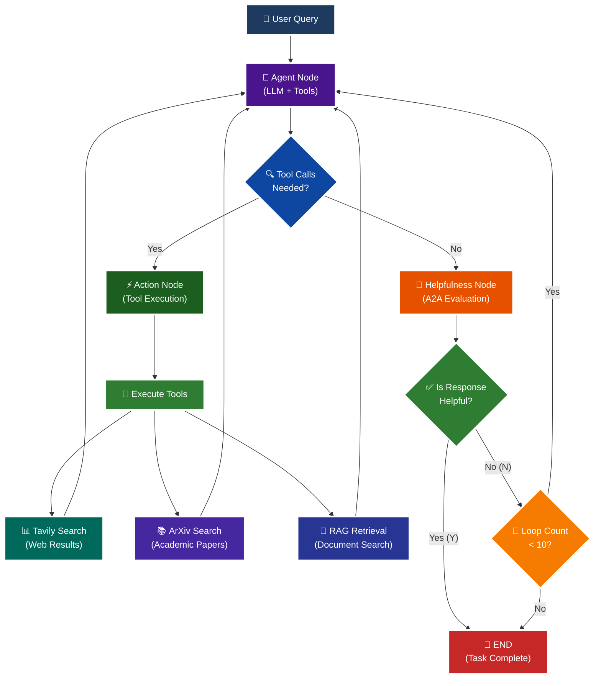

<p align = "center" draggable="false" >
</p>

## <h1 align="center" id="heading">Session 15: Build & Serve an A2A Endpoint for Our LangGraph Agent</h1>

| 🤓 Pre-work | 📰 Session Sheet | ⏺️ Recording     | 🖼️ Slides        | 👨‍💻 Repo         | 📝 Homework      | 📁 Feedback       |
|:-----------------|:-----------------|:-----------------|:-----------------|:-----------------|:-----------------|:-----------------|

# A2A Protocol Implementation with LangGraph

This session focuses on implementing the **A2A (Agent-to-Agent) Protocol** using LangGraph, featuring intelligent helpfulness evaluation and multi-turn conversation capabilities.

## 🎯 Learning Objectives

By the end of this session, you'll understand:

- **🔄 A2A Protocol**: How agents communicate and evaluate response quality

## 🧠 A2A Protocol with Helpfulness Loop

The core learning focus is this intelligent evaluation cycle:



# Build 🏗️

Complete the following tasks to understand A2A protocol implementation:

## 🚀 Quick Start

```bash
# Setup and run
./quickstart.sh
```

```bash
# Start LangGraph server
uv run python -m app
```

```bash
# Test the A2A Server
uv run python app/test_client.py
```

### 🏗️ Activity #1:

Build a LangGraph Graph to "use" your application.

Do this by creating a Simple Agent that can make API calls to the 🤖Agent Node above through the A2A protocol.

**Implementation**: A simple LangGraph agent has been created in `app/activity1_client.py` that uses the A2A protocol to communicate with your server.

**To run Activity #1:**

1. **Start the A2A server** (in one terminal):
   ```bash
   uv run python -m app
   ```
   The server will start on `http://localhost:10000`

2. **Run the Activity #1 client** (in another terminal):
   
   **Option A: Automated test with sample queries**
   ```bash
   uv run python app/activity1_client.py
   ```
   
   **Option B: Interactive mode (type your own queries)**
   ```bash
   uv run python app/activity1_interactive.py
   ```
   
   **Option C: Debug response structure (troubleshooting)**
   ```bash
   uv run python app/debug_response.py
   ```

**What the client does:**
- Fetches the agent card from your server using `A2ACardResolver`
- Creates a LangGraph with a single node that calls the A2A server
- Sends queries via A2A protocol and extracts responses
- Handles multi-turn conversations with task_id/context_id
- Automatically retries when tasks are in terminal state

**Key features:**
- ✅ Clean, simplified code (< 200 lines per file)
- ✅ Proper error handling and terminal state recovery
- ✅ Multi-turn conversation support
- ✅ Response extraction from A2A artifacts
- ✅ Debug script for troubleshooting

This demonstrates how to use LangGraph to create agents that communicate via the A2A protocol! 

### ❓ Question #1:

What are the core components of an `AgentCard`?

##### ✅ Answer:

An `AgentCard` is a standardized metadata document that describes an AI agent's capabilities, making it discoverable and interoperable through the A2A protocol. The core components include:

1. **Basic Identity**: `name`, `description`, `url`, and `version` - These provide fundamental information about the agent's identity and location.

2. **Content Modes**: `default_input_modes` and `default_output_modes` - These specify what content types the agent can handle (e.g., 'text', 'text/plain', images, etc.).

3. **Capabilities**: A `capabilities` object that describes what the agent can do, such as:
   - `streaming`: Whether the agent supports streaming responses
   - `push_notifications`: Whether the agent can send push notifications
   - Other protocol-level features

4. **Skills**: An array of `AgentSkill` objects, where each skill includes:
   - `id`: Unique identifier for the skill
   - `name`: Human-readable name
   - `description`: What the skill does
   - `tags`: Categorization keywords
   - `examples`: Example queries that demonstrate the skill

5. **Extended Card Support**: Optional support for authenticated extended cards that provide additional capabilities not exposed in the public card.

The AgentCard serves as a "business card" for agents, allowing them to discover each other's capabilities and communicate effectively without prior knowledge of each other's implementation details.

<br />

### ❓ Question #2:

Why is A2A (and other such protocols) important in your own words?

##### ✅ Answer:

A2A (Agent-to-Agent) protocol and similar standardization protocols are crucial for the future of AI agent ecosystems for several key reasons:

1. **Interoperability**: Just like HTTP enabled different web browsers and servers to communicate, A2A allows agents built with different frameworks (LangGraph, LangChain, custom implementations) to seamlessly communicate with each other. This breaks down vendor lock-in and enables agents to work together regardless of their underlying technology.

2. **Discovery & Composition**: Agents can discover each other's capabilities through AgentCards, allowing for dynamic composition of multi-agent systems. An agent can find and leverage specialized agents without needing to know their implementation details beforehand.

3. **Standardized Quality Assurance**: The A2A protocol includes built-in evaluation mechanisms (like the helpfulness loop we implemented) that ensure agents maintain quality standards. This creates a self-regulating ecosystem where agents evaluate and improve their responses.

4. **Scalability & Distribution**: As AI systems become more complex, we'll need distributed architectures where specialized agents handle specific domains. A2A provides the foundation for building such distributed agent networks where agents can collaborate, delegate tasks, and share knowledge.

5. **Future-Proofing**: By adopting standardized protocols early, we're building infrastructure that will support the evolution of AI systems. As new capabilities emerge, they can be integrated into the protocol, ensuring backward and forward compatibility.

In essence, A2A is to AI agents what HTTP/TCP-IP was to the internet - a foundational protocol that enables a decentralized, interoperable ecosystem where innovation can flourish across different implementations and vendors.

<br /><br />

<details>
<summary>🚧 Advanced Build 🚧 (OPTIONAL - <i>open this section for the requirements</i>)</summary>

Use a different Agent Framework to **test** your application.

Do this by creating a Simple Agent that acts as different personas with different goals and have that Agent use your Agent through A2A. 

Example:

"You are an expert in Machine Learning, and you want to learn about what makes Kimi K2 so incredible. You are not satisfied with surface level answers, and you wish to have sources you can read to verify information."
</details>

## 📁 Implementation Details

For detailed technical documentation, file structure, and implementation guides, see:

**➡️ [app/README.md](./app/README.md)**

This contains:
- Complete file structure breakdown
- Technical implementation details
- Tool configuration guides
- Troubleshooting instructions
- Advanced customization options

# Ship 🚢

- Short demo showing running Client

# Share 🚀

- Explain the A2A protocol implementation
- Share 3 lessons learned about agent evaluation
- Discuss 3 lessons not learned (areas for improvement)

# Submitting Your Homework

## Main Homework Assignment

Follow these steps to prepare and submit your homework assignment:
1. Create a branch of your `AIE8` repo to track your changes. Example command: `git checkout -b s15-assignment`
2. Complete the activity above
3. Answer the questions above _in-line in this README.md file_
4. Record a Loom video reviewing the Simple Agent you built for Activity #1 and the results.
5. Commit, and push your changes to your `origin` repository. _NOTE: Do not merge it into your main branch._
6. Make sure to include all of the following on your Homework Submission Form:
    + The GitHub URL to the `15_A2A_LANGGRAPH` folder _on your assignment branch (not main)_
    + The URL to your Loom Video
    + Your Three Lessons Learned/Not Yet Learned
    + The URLs to any social media posts (LinkedIn, X, Discord, etc.) ⬅️ _easy Extra Credit points!_

### OPTIONAL: 🚧 Advanced Build Assignment 🚧
<details>
  <summary>(<i>Open this section for the submission instructions.</i>)</summary>

Follow these steps to prepare and submit your homework assignment:
1. Create a branch of your `AIE8` repo to track your changes. Example command: `git checkout -b s015-assignment`
2. Complete the requirements for the Advanced Build
3. Record a Loom video reviewing the agent you built and demostrating in action
4. Commit, and push your changes to your `origin` repository. _NOTE: Do not merge it into your main branch._
5. Make sure to include all of the following on your Homework Submission Form:
    + The GitHub URL to the `15_A2A_LANGGRAPH` folder _on your assignment branch (not main)_
    + The URL to your Loom Video
    + Your Three Lessons Learned/Not Yet Learned
    + The URLs to any social media posts (LinkedIn, X, Discord, etc.) ⬅️ _easy Extra Credit points!_
</details>